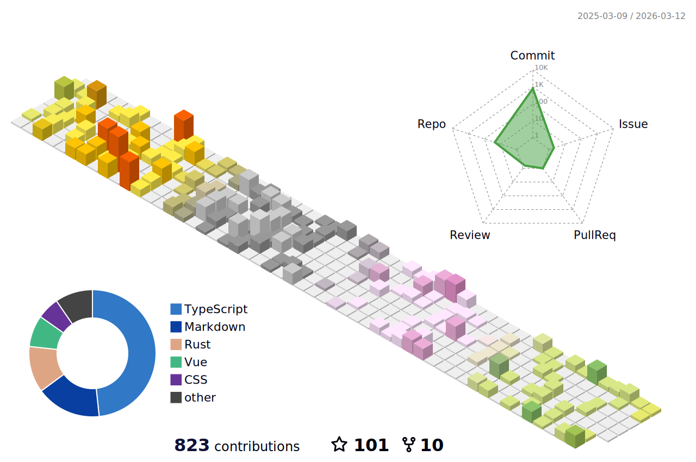

  
  <h2 align="center">诡锋 (Vincent)</h2>
  
:clap: 一个喜欢Rust编程和Web前端开发的普通人。 :clap:

    
:clap: Rust Programming & Web Frontend hobbyist.^v^ :clap:

  

Personal website(个人网站): <a href="https://blog.vince-g.xyz" 
              target="_blank">https://blog.vince-g.xyz</a>
  

  

    Sponsor 赞助：<a href="https://afdian.net/a/vince-g" target="_blank">https://afdian.net/a/vince-g</a>
  

  

  Bilibili:
  <a href="https://space.bilibili.com/3342738" 
     target="_blank">诡锋的B站</a>
  

  
Discord:
    <a href="https://discord.gg/qZBVS8yyyY" 
     target="_blank">诡锋的Discord</a>
  

   
  <h1 align="center"> 
     
  </h1>
  <!-- Gif -->
  

    
    
    
    
    
    
    
  

  
  <!-- img -->
  

<h3>OS</h3>

<h3>Skills</h3>

<h4>Programming Languages</h4>

<h4>Web Frontend Development</h4>

<h3>Gaming</h3>

---

# Visits

# Info

    
     
    
     
    <!-- most used languages-->
    
     

# Streak(连续打卡）

  

# Activities

  

