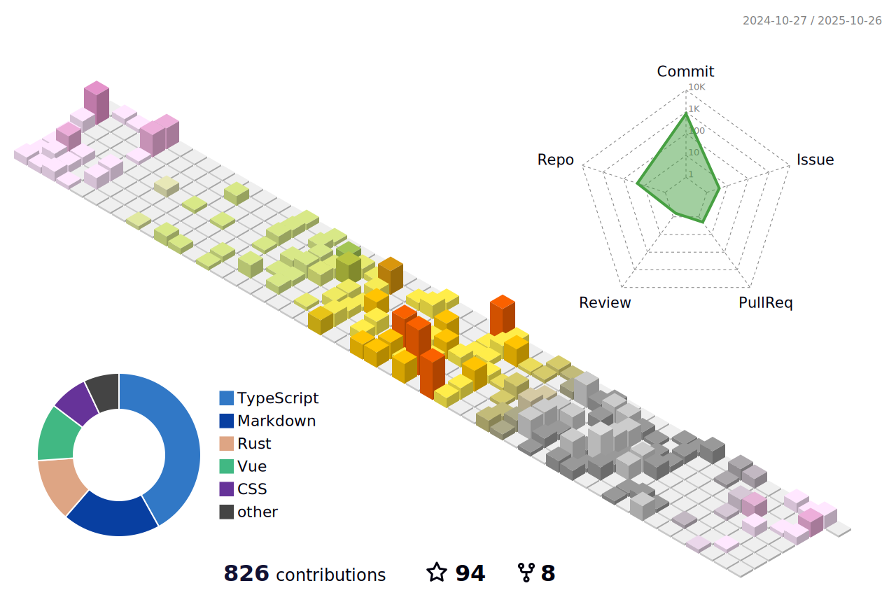

  
  <h2 align="center">诡锋 (Vincent)</h2>
  
:clap: Coding for fun ^_^ :clap:

  

Personal website(个人网站): <a href="https://blog.vince-g.xyz" 
              target="_blank">https://blog.vince-g.xyz</a>
  

  

  Bilibili:
  <a href="https://space.bilibili.com/3342738" 
     target="_blank">诡锋的B站</a>
  

  
Discord:
    <a href="https://discord.gg/qZBVS8yyyY" 
     target="_blank">诡锋的Discord</a>
  

   
  <h1 align="center"> 
     
  </h1>
  <!-- Gif -->
  

    
    
    
    
    
    
    
  

  
  <!-- img -->
  

### OS

### Skills

#### Languages/Frameworks

#### Tech Stacks

#### Editor/IDE

#### Others

### Gaming

# Visits

# Info

    
     
    
     

# Streak

  

# Activities

  

